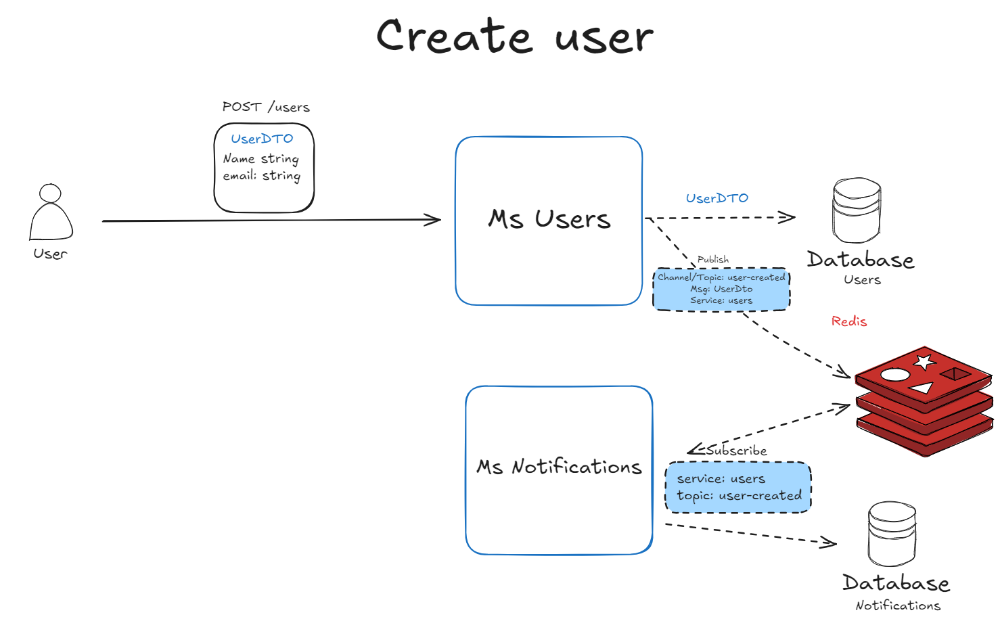

# Microserviço de notificaçoes

Projeto para estudos de microserviços com pattern pub/sub.

## Arquitetura


## 🚀 Começando

Essas instruções permitirão que você obtenha uma cópia do projeto em operação na sua máquina local para fins de desenvolvimento e teste.


### 📋 Pré-requisitos

```
Npm
Redis insights
```

### 🔧 Instalação

1-Passo
```
npm i
```

2-Passo

```
Configure o seu .env
```

Termine com um exemplo de como obter dados do sistema ou como usá-los para uma pequena demonstração.

```

## 🛠️ Construído com

* [Nestjs](https://nestjs.com/) - O framework web usado
* [npm](https://www.npmjs.com/) - Gerente de Dependência


